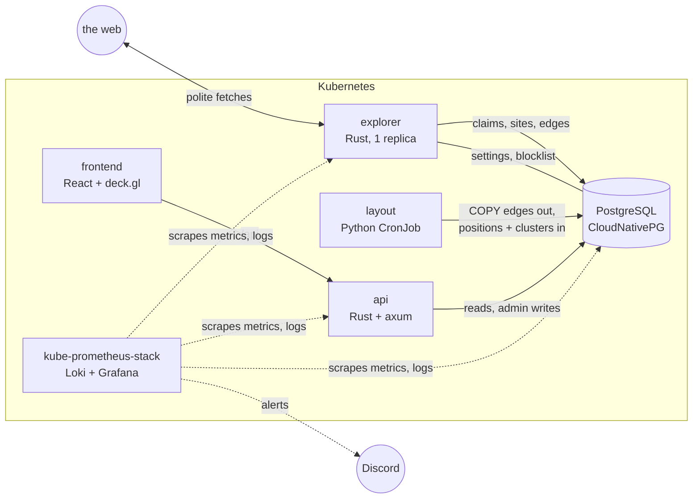

# Explorer design

> Status: **approved**. Decided through a design review on 2026-09-25 to 27 (decision log at the end). The spikes on throughput, Postgres, layout and 3D layouts, with their code, results and research sources, are in [`spikes/`](../spikes/README.md).

## Summary

The explorer is a web crawler that **explores the open web continuously and draws a living map of it**. Each dot on the map is a website, meaning a registered domain such as `wikipedia.org`. Dots sit close together when the sites link to each other, and colors show regions of the web. The map grows as the crawler discovers new sites.

It replaces the current design (a separate subgraph per crawl, 8 feeders claiming individual pages from Neo4j) with a much simpler shape:

- **one explorer process** is the only writer
- **PostgreSQL** is the single source of truth
- a **daily layout job** turns the site graph into map positions
- a **WebGL map** draws a million dots

## Goals

- A visual, explorable map of the web at the level of sites, reaching **1M+ visited sites in about 3 months** in production.
- A **good citizen** on the open web: robots.txt, a clear User-Agent, per-site rate limits, opt-outs, and never private networks.
- **Observability before production**: metrics, logs, a Grafana health dashboard, and Discord alerts.
- **Simple to run**: few moving parts, and mainstream tools over custom ones ([project vision](project-vision.md)).

## Non-goals (for now)

- Pages as map nodes, page-level drill-down, or storing page content.
- Topic-steered exploration and Jev classification (later add-ons, see [Future](#future)).
- Revisiting sites that have already been visited (the data model is ready for it).
- A public deployment or authentication. It stays private and is reached through `kubectl port-forward`.
- Multiple explorer processes (the code keeps a seam for this, and Postgres supports it).

## Why the old design was replaced

The old design distributed **pages** across 8 feeders that coordinated through Neo4j. Every page needed about 5 shared-state round trips (claim, cancel check, dedup, child `MERGE`, status update), and each round trip was a race. The consequences:

- The same job was claimed by several feeders at once (Neo4j is read-committed and has no `SKIP LOCKED`).
- Duplicate nodes, because `MERGE` without a uniqueness constraint races.
- An approximate page budget and a depth that depended on processing order.
- Deadlocks, plus stale reclaims of jobs that were still running.

Only 8 fetches were in flight in total, and nothing rate-limited per host. The explorer removes the shared per-page state entirely. There is one writer, and Postgres gives real row locks.

## Architecture



| Component | Role | Tech |
|---|---|---|
| `explorer` | Picks the next sites, visits them politely, and writes site records and edges. The only writer of crawl data. | Rust, tokio, reqwest, sqlx |
| `postgres` | The single source of truth: sites, edges, map positions, settings, blocklist. | PostgreSQL 18 run by the CloudNativePG operator |
| `layout` | A daily batch job: exports the site graph, clusters it, computes 2D positions, and writes them back. | Python, python-igraph (Leiden), openTSNE (graph t-SNE) |
| `api` | Map data, site lookups, search, stats, and the admin controls. | Rust, axum (evolves from `manager`) |
| `frontend` | The map, the site view, and the admin panel. | React, Vite, Tailwind, deck.gl |
| observability | Metrics, logs, the dashboard, alerts. | kube-prometheus-stack, Loki + Grafana Alloy |

The `shared` crate keeps URL normalization, link extraction and the fetch helpers from the page-crawling work. The old `feeder`, `manager`, the Neo4j subchart and all Cypher code are removed.

### Why these choices

- **One explorer.** The per-site politeness gap limits throughput, not CPU. The spike measured about 0.07 completed sites/s per parallel visit and a linear speed-up. The default 8 parallel visits gives about 48k sites/day (1M in about 3 weeks). 64 parallel visits used about 19% of one core and 185 MB RSS.
- **PostgreSQL over Neo4j.** The workload is shaped like a graph, but it doesn't need a graph engine. Writes are tiny, online queries go 1–2 hops, and the heavy graph work runs in igraph. Postgres + CNPG wins on online backups with point-in-time restore, a mature Rust client (`sqlx`), `COPY` export speed, and disk-based scaling to 10M sites. Neo4j Community has only offline dumps and a Rust client that has been a release candidate since 2024. The one thing given up is Neo4j Browser; the [hybrid option](#future) can bring it back as a disposable read-only copy.
- **igraph** for clustering, **openTSNE** for layout, **deck.gl** for drawing, **CNPG** for Postgres, **kube-prometheus-stack** for observability. All mainstream tools, nothing custom where a tool exists.

## Data model

The unit is the **registered domain** (eTLD+1 from the public-suffix list, including its private section, so `alice.github.io` and `bob.github.io` are separate sites). Only site-level data is stored. Pages are fetched, their links are counted, and then they're discarded.

```sql
CREATE TABLE domains (
  id              bigint GENERATED ALWAYS AS IDENTITY PRIMARY KEY,  -- id order = discovery order
  name            text     NOT NULL UNIQUE,         -- 'wikipedia.org'
  status          smallint NOT NULL DEFAULT 0,      -- 0 discovered, 1 visiting, 2 visited, 3 failed, 4 blocked
  rk              smallint NOT NULL DEFAULT (random() * 32767)::int,  -- random key for frontier picks
  is_seed         boolean  NOT NULL DEFAULT false,
  discovered_at   timestamptz NOT NULL DEFAULT now(),
  claimed_at      timestamptz,
  fetched_at      timestamptz,                      -- set on every visit attempt (enables revisits later)
  failure_reason  text,                             -- 'dns', 'timeout', 'http_4xx', 'robots_denied', ...
  http_status     smallint,
  scheme          text,                             -- 'https' or 'http' (fallback)
  title           text,
  description     text,
  lang            text,                             -- from <html lang>
  server          text,                             -- Server header
  ip              inet,                             -- address actually connected to
  pages_fetched   smallint,
  out_domains     integer                           -- distinct external domains linked
);

CREATE TABLE edges (                                -- site A links to site B
  src     bigint   NOT NULL REFERENCES domains(id),
  dst     bigint   NOT NULL REFERENCES domains(id),
  weight  smallint NOT NULL,                        -- number of A's fetched pages linking to B (1–5)
  nofollow boolean NOT NULL DEFAULT false,          -- true if every link from A to B is rel="nofollow"
  PRIMARY KEY (src, dst)
);
CREATE INDEX edges_dst ON edges (dst);              -- "who links to X"

CREATE TABLE layout_runs (                          -- one row per daily layout run
  id          bigint GENERATED ALWAYS AS IDENTITY PRIMARY KEY,
  finished_at timestamptz,
  is_current  boolean NOT NULL DEFAULT false        -- the pointer the API follows (exactly one true)
);

CREATE TABLE positions (                            -- written by the layout job, one partition per run
  layout_run bigint NOT NULL,
  domain_id  bigint NOT NULL,                       -- no foreign keys into or out of this table
  x real NOT NULL, y real NOT NULL,
  cluster    integer,
  pagerank   real,                                  -- computed by the daily run; sets star size on the map
  placed     boolean NOT NULL DEFAULT false,        -- true for 10-minute incremental placements
  PRIMARY KEY (layout_run, domain_id)
) PARTITION BY LIST (layout_run);

CREATE TABLE settings (                             -- admin controls, polled by the explorer
  key text PRIMARY KEY, value jsonb NOT NULL        -- paused, parallel_visits, ...
);

CREATE TABLE blocklist (                            -- opt-outs, matched on registered domain
  name text PRIMARY KEY, reason text, added_at timestamptz NOT NULL DEFAULT now()
);
```

- **Edges** are written for every external domain a visited site links to, including domains not visited yet (they are inserted as `discovered`). When such a domain is visited later, its incoming edges are already in place.
- **The map shows visited sites only** (`status = 2`). Failed, blocked and discovered domains are not dots.

### Indexes and tuning (from the Postgres spike)

```sql
CREATE INDEX domains_frontier  ON domains ((id >> 14), rk) WHERE status = 0;   -- next-site selection
CREATE INDEX domains_seeds     ON domains (id)             WHERE status = 0 AND is_seed;
CREATE INDEX domains_visiting  ON domains (claimed_at)     WHERE status = 1;   -- restart reset
ALTER TABLE domains SET (autovacuum_vacuum_scale_factor = 0.01,
                         autovacuum_vacuum_threshold = 10000,
                         autovacuum_vacuum_insert_scale_factor = 0.01);
```

- Status updates can never be the cheap in-place (HOT) kind, because `status` is indexed. That's fine at this rate. The per-table autovacuum settings keep dead rows from reaching the default 20% of the table.
- Keep the default fillfactor.
- Never run `count(*) … GROUP BY status` on a hot path. It's a 16-second scan at 50M rows. Use `pg_class.reltuples` or the small partial indexes.

**Measured on Postgres 18 in Docker at 50M domains (the 10M-site scenario):**
- Claiming 8 domains takes about 2–4 ms p50. The worst outlier was about 400 ms, during a checkpoint.
- Inserts have about 85× headroom.
- Two concurrent claimers produced no duplicates.
- The heap is about 100 B/row; indexes total about 5 GB.

## Explorer

### Loop

1. Read `settings`. If paused, sleep.
2. Keep up to `parallel_visits` (default **8**) visits in flight. When a slot frees up, claim more sites.
3. **Claim.** Pending seeds go first, then the frontier. Bucketed novelty picks randomly within the oldest block of about 16k discovered domains, which breaks up clumps of domains discovered together:
   ```sql
   WITH l AS (
     SELECT id FROM domains WHERE status = 0
     ORDER BY (id >> 14), rk LIMIT $k
     FOR UPDATE SKIP LOCKED)
   UPDATE domains d SET status = 1, claimed_at = now()
   FROM l WHERE d.id = l.id RETURNING d.id, d.name;
   ```
4. **Visit** each claimed site (see below).
5. **Write**, in one transaction per visit:
   - update the site row (status, metadata, `fetched_at`)
   - `INSERT … ON CONFLICT (name) DO NOTHING` for newly discovered domains (blocklisted names are inserted as `blocked`)
   - upsert edges

**On startup**, reset `visiting` rows back to `discovered`. With one explorer, that's all of them. If a second explorer is ever added, reset only rows whose `claimed_at` is older than 5 minutes.

### A visit

1. Check the blocklist, then resolve DNS through a resolver that **rejects non-public addresses** (private, loopback, link-local, CGNAT, multicast, ULA). Every connection goes through it, including redirects.
2. Fetch `/robots.txt` once per host and cache it. A 4xx means allow everything; a 5xx or timeout means skip the site. Use the token `WebCrawlerExplorer`.
3. Fetch the homepage `https://<domain>/`. Fall back to `http://` only when HTTPS can't connect.
4. Fetch up to **4 internal pages** (same registered domain): the ones most linked from the homepage. That makes at most **5 pages per visit**.
5. Record every **external registered domain** linked from the fetched pages as a directed edge **A → B**: the site whose page holds the link is the source. An edge's weight is how many of the fetched pages link to that domain. An edge is flagged `nofollow` when every link from A to B carries `rel="nofollow"`. Links within A's own registered domain are internal: they choose which pages to fetch next and are never edges.

### Politeness and safety rules

| Rule | Value |
|---|---|
| User-Agent | `WebCrawlerExplorer/1.0 (+https://github.com/nabi-allenby/web-crawler)` |
| Requests per host | Sequential, at least `max(1 s, Crawl-delay)` apart |
| Crawl-delay above 10 s | Homepage only |
| Crawl-delay above 60 s | Skip the site |
| HTTP 429 or 503 | Stop the visit immediately |
| Timeouts | 10 s per request, 240 s per visit |
| Redirects | At most 5, each checked against robots.txt |
| Body | Capped at 2 MB (streamed); non-HTML skipped |
| Opt-out | Blocklist in Postgres, managed from the admin panel |

**Production runs from Azure (West Europe) IPs.** Bot-protection services block datacenter ranges more than home connections, so expect more 403s than the spike's roughly 8% 4xx. **This is accepted, not evaded.** There are no residential proxies and no disguising the crawler. The dashboard and the error-rate alert track it.

### Testing

The visit and claim logic sits behind `Fetcher` and `Store` traits. That makes the explorer testable against a fake web, deterministically: politeness timing, robots handling, edge weights, and claim/restart behavior. Store behavior is tested against a real Postgres, either a disposable container in CI or CNPG on minikube.

## Layout

A **Python CronJob, run daily**, turns the site graph into the map:

1. **Export.** `COPY` every edge between visited sites out of Postgres, about 13–16M rows at 1M sites.
2. **Cluster.** Leiden (modularity, weighted) gives each site a cluster ID. That's the default map color, and it's shown in the site view.
3. **Position with graph t-SNE** ([openTSNE](https://opentsne.readthedocs.io/), BSD-3, pip). t-SNE runs directly on the link graph. The affinities are the row-normalized adjacency, symmetrized (`P = (D⁻¹A + (D⁻¹A)ᵀ) / 2n`); the row normalization keeps hubs from dominating. This follows Böhm et al., *Graph neighbor embeddings* (TMLR 2025).
   - **Daily run, seeded.** Start from yesterday's coordinates. New sites start at the weighted mean position of their already-placed neighbors. Run 250 iterations with no early exaggeration: about 100 s and 1.5 GB at 1M sites. Sites move a median of about 2% of the map radius per day, so **the geography stays stable**.
   - **Occasional fresh run.** A full run from scratch takes about 4 minutes. After one, rotate and scale the result to line up with the previous map.
   - **Toward 10M sites.** Whole-graph t-SNE would need about 12–15 GB (extrapolated). Switch to a hierarchy instead: lay out the Leiden cluster graph, then run seeded t-SNE inside each large cluster. That keeps memory bounded by the largest cluster, at about 25–40 minutes per day on 8 cores (extrapolated). A GPU node is the other option.
4. **Rank.** Compute **PageRank** (igraph, damping 0.85) on the *directed* edges, leaving out nofollow edges. Unvisited domains have no outgoing links, so their rank is spread over all sites. This takes seconds at 1M sites. PageRank sets each site's star size on the map.
5. **Write back.** Load the positions, clusters and PageRank into a new `positions` partition, then make that run current.

**Between runs,** sites visited after the last run are placed at the weighted average position of their already-placed neighbors, plus a little jitter. They take the cluster of the neighbors they're most strongly linked to. This runs as a small job **every 10 minutes**, so new sites appear on the map within minutes.

**Measured on a synthetic web-like graph at 1M sites (12.4M edges), Apple M4.**

Leiden (2 iterations) took 12 s and 1.4 GB, with 0.98 agreement (NMI) with the planted clusters. Loading the graph took 16 s.

The layouts:

| Layout | Time | Memory | Purity | Neighbor recall |
|---|---|---|---|---|
| **Graph t-SNE, seeded (chosen)** | **97 s** | 1.5 GB | 0.98 | **0.060** |
| Graph t-SNE, fresh | 211–266 s | 1.6–1.8 GB | 0.98 | 0.053 |
| Graph UMAP | 23 s | 2.2 GB | 0.96 | 0.019 |
| Hierarchy + t-SNE inside large clusters | 151 s | 1.3 GB | 0.86 | 0.017 |
| One-level hierarchy (circles + spiral) | 4 s | 0.7 GB | 0.84 | 0.014 |
| Spectral (2D / 3D / 16D) | 7–34 s | 1.4 GB | 0.16 / 0.34 / 0.89 | 0.003 / 0.009 / 0.031 |
| DrL | didn't finish in 38 min (est. 1.5–2 h) | ~2 GB | – | – |

- **Purity** is the share of each dot's 10 nearest dots that are in its own community.
- **Neighbor recall** is the share of a site's linked sites among its nearest dots. Random placement within the right community scores 0.012.
- **Also ruled out:** FM³ (ran out of memory at 1M), ForceAtlas2 on CPU (hours), stress/MDS layouts (collapse to a featureless disc on small-world graphs), and 3D layouts (see [Future](#future)).

At 10M sites, Leiden in igraph needs about 14 GB (mostly the graph itself), so that scale needs a bigger node or a leaner tool.

**To validate on real crawl data in M3:**
- whether related clusters end up near each other (the synthetic graph can't test this)
- drift over many days of seeded runs

## API

The `api` evolves from `manager`: Rust + axum, reading Postgres.

| Endpoint | Purpose |
|---|---|
| `GET /api/v1/map/manifest.json` | Points at the current run's positions file and its latest delta (short cache lifetime) |
| `GET /api/v1/map/<run>.arrow` | The immutable positions file for one layout run (cached forever) |
| `GET /api/v1/map/<run>/delta?since=` | Sites placed by the 10-minute job since the run, merged on the client |
| `GET /api/v1/sites/{name}` | Site metadata, the number of referencing sites (counted from `edges`), and its PageRank rank |
| `GET /api/v1/sites/{name}/neighbors?dir=in\|out` | Linked sites, with weights |
| `GET /api/v1/search?q=` | Domain search |
| `GET /api/v1/stats` | Counts for the map and the admin panel |
| `POST /api/v1/admin/seeds` | Add seeds (inserted with `is_seed`, so they're claimed first) |
| `PUT /api/v1/admin/settings` | Pause/resume, `parallel_visits` |
| `GET/POST/DELETE /api/v1/admin/blocklist` | Manage opt-outs |
| `GET /api/v1/admin/domains/{name}` | Why a domain is in the frontier, and who linked to it |

**Positions files.** This follows the established pattern of keeping the truth in the database and serving a cached, immutable file built from it, the way PostGIS-based tile servers do.
- **Loading a run.** The layout job loads each run into a new `positions` partition and then flips `layout_runs.is_current`. Old partitions are detached and dropped later. This follows Postgres's documented approach to bulk loads, which avoids the churn of mass updates and the lock and view pitfalls of swapping tables by renaming them.
- **The file.** For each run the API builds one **Apache Arrow** file (the columnar format kepler.gl, Embedding Atlas and Nomic use, which deck.gl loads straight into the GPU). Columns: `domain_id u32`, `x f32`, `y f32`, `cluster u32`, `tld u8`, `lang u8`, `first_seen_day u16`, `pagerank_pct u8` (PageRank percentile, 0–100). That's about 16 MB at 1M sites, and about 11 MB gzipped.
- **Caching.** Files are immutable and versioned by run, so they can be cached forever. A small `manifest.json` points at the current one. Names come from the API on hover.
- **Scale.** deck.gl handles about 1M points at 60 fps; about 10M in one file (~160 MB) is a poor default. From around **3–5M sites**, the builder switches to spatial tiles (deck.gl `TileLayer` with an orthographic view, or PMTiles on Blob Storage). The builder sits behind a "layout run → files" interface, and every file carries stable integer ids, so the switch needs no schema change.

The admin controls work through Postgres. The API writes `settings` and `blocklist`, and the explorer polls them every few seconds. There is no second channel.

## Frontend

React + Vite + Tailwind stay; the force-graph view is replaced.

- **Whole-web map (deck.gl).** It loads the positions file and draws every visited site as a dot in a 2D pan/zoom view.
  - **Color switcher:** cluster (default), TLD, language, age (first seen).
  - **Star size from PageRank percentile,** so important sites shine without big hubs covering the map. Scaling by percentile keeps sizes steady as PageRank is recomputed daily. Hover shows the rank ("#1,284 of 1M") and the reference count ("referenced by 48,210 sites") from the API. Early in the crawl, rank reflects the part of the web explored so far.
  - **Labels** for the most-linked sites at each zoom level.
  - **Edges only for the selected or hovered site.** Drawing tens of millions of lines at once is just noise.
- **Site view.** Metadata, plus incoming and outgoing neighbors, which you can click to jump to.
- **Admin panel.** Seeds, pause/resume, crawl rate, blocklist, domain lookup, live stats.
- **Theme.** Cartoony and playful, cobweb-themed, per the [project vision](project-vision.md).

## Observability

Built out on minikube **before** production.

- **Metrics:** `kube-prometheus-stack` (Prometheus, Alertmanager, Grafana, node and kube-state metrics). The explorer and api expose `/metrics`, and CNPG's metrics are scraped via PodMonitor.
- **Logs:** Loki plus Grafana Alloy, searchable in Grafana.
- **Traces:** later (Tempo + OpenTelemetry).

**Explorer metrics (initial):**
- visits by outcome
- pages fetched
- HTTP responses by status class
- request duration histogram
- bytes downloaded
- robots denials
- Crawl-delay histogram
- new domains discovered
- parallel visits in use
- body-cap hits
- time of the last completed visit

**Crawler health dashboard (Grafana), top to bottom:**
1. **Throughput:** sites completed per hour against the target, pages/s, parallel visits in use.
2. **Visit outcomes over time:** completed, DNS, timeout, 4xx, 5xx, robots-refused, 429/503.
3. **Politeness:** 429/503 rate, Crawl-delay distribution, sites skipped for Crawl-delay.
4. **Discovery:** frontier size, new domains per visit, total sites visited.
5. **Fetching:** request latency p50/p95, bytes per hour, body-cap hits.
6. **Map pipeline:** the layout job's last success and duration, age of the positions.
7. **Database:** size and growth, connections, backup/archive status.
8. **Explorer process:** CPU, memory, restarts.

**Alerts, sent to Discord through Alertmanager:**
1. Explorer down, or no completed visit in 15 minutes.
2. Sites per hour below 50% of what the configured pace implies.
3. Error rate by type spiking.
4. **429/503 responses rising** (politeness failing).
5. Database disk above 80%.
6. Backup or write-ahead-log archiving failing.
7. Map positions older than 36 hours.

## Deployment

**Minikube (testing):** everything, including the observability stack, at reduced sizes. Postgres runs through CNPG with 1 instance.

**Production (deferred to a production-readiness stage):**
- **AKS in West Europe.**
- **Postgres:** CNPG with **1 instance**, plus continuous backup to **Azure Blob Storage** with **14 days of point-in-time restore**. Moving to 3 instances with automatic failover is a one-line change.
- **Positions file:** moves to Blob Storage.
- **Access:** `kubectl port-forward` only at first. OAuth (oauth2-proxy with GitHub login) comes later, which also enables a public read-only map.
- **Starting size:** about 2–3 nodes of 4 vCPU / 8–16 GB. Postgres needs about 4 GB of RAM at 1M sites and 8 GB at 10M, the layout job bursts to about 4–8 GB, and observability takes about 2–4 GB.

**Initial seeds:** wikipedia.org, archive.org, metmuseum.org, europa.eu, gov.br, un.org, mit.edu, u-tokyo.ac.jp, uct.ac.za, ynet.co.il, thehindu.com, bandcamp.com. Each one's reachability from West Europe and its robots.txt are checked before production.

## Capacity (from the spikes)

| | 1M visited sites | 10M visited sites |
|---|---|---|
| Time at 8 parallel visits | ~3 weeks | ~7 months (raise the pace) |
| Download | ~260 KB per visit, ~12 GB/day at 8 parallel visits | same per visit |
| Known domains (visited + discovered) | ~2–6M | ~20–60M (estimate) |
| Edge rows | ~13–16M | ~130–160M |
| Postgres disk | ~3–5 GB | ~30–50 GB |
| Frontier claim latency | ~1–3 ms p50 | ~2–4 ms p50 |

The visit and throughput numbers come from about 2,600 real visits run from a home connection on macOS. The Postgres numbers come from synthetic data in Docker.

## Risks

- **Datacenter IPs get blocked more.** Accepted; measured through the dashboard and alert 3.
- **Frontier clumps** (e.g. a batch of unreachable `.gov.cn` sites). Mitigated by bucketed random selection. Backing off a failing TLD or hosting network can be added if the logs show it's needed.
- **Layout at 10M sites.** Whole-graph t-SNE and Leiden outgrow an 8 GB node. The hierarchy-plus-t-SNE path and the GPU option are defined in [Layout](#layout).
- **Politeness regressions.** Alert 4 fires when 429/503 responses rise; pausing is one click in the admin panel.
- **Only one Postgres instance.** Minutes of downtime on node failure, with point-in-time restore from Blob. The data can also be regenerated by re-crawling.

## Future

- **Travel between the stars (3D).** Fly between sites as if they were stars in the Milky Way, with each star's size and brightness set by its PageRank.
  - **Candidate layouts, measured at 1M:** 3D graph UMAP (17 s), a "globe" (55 s), or 3D t-SNE (18 min, SG-t-SNE-Π). Each could be an extra column in the daily job.
  - **Prior art:** anvaka's [pm](https://github.com/anvaka/pm), 3D "galaxies" of more than 1.1M nodes rendered at 60 fps.
  - **Why the main map stays 2D:** usability studies favor 2D on flat screens for overview and for remembering where things are (Munzner: "no unjustified 3D").
- **Jev classification:** one call per site from its homepage (category, parked/spam, adult, language), used as another map color. Estimated at about $84 per 1M sites.
- **Topic mode:** Jev relevance as an extra term in the novelty score, so exploration heads toward a subject.
- **Revisits:** a small share of fetches (e.g. 10%) spent refreshing the stalest sites, using `fetched_at`.
- **Neo4j projection:** the nightly job also rebuilds a read-only Neo4j from the same export, for exploring in Neo4j Browser.
- **Public read-only map** behind OAuth, **traces**, **multiple explorers** (`SKIP LOCKED` is already safe, and domains can be partitioned by hash beyond about 50M sites), and **dataset dumps** (GraphML or Parquet).

## Open items

None. All 44 questions are decided. Two things are validated on real data during M3: whether related clusters end up near each other, and drift over many days of seeded layouts.

## Milestones

Each milestone ends with something working on minikube.

1. **M1: Explorer, Postgres and observability.** The explorer crawls into Postgres (CNPG), with metrics, logs and the Grafana health dashboard.
2. **M2: API, admin panel and alerts.** Seeds, pause/resume, rate, blocklist, domain lookup, live stats, Discord alerts.
3. **M3: Layout and map.** The layout CronJob, the 10-minute placement job, the Arrow positions files, and the deck.gl map with the color switcher and site view.
4. **M4: Production readiness.**
   - AKS in West Europe
   - Blob backups with 14-day point-in-time restore
   - positions files on Blob Storage and a CDN
   - seeds verified
   - removal of the old crawler and Neo4j

Each milestone includes its CI/Helm changes.

## Decision log

| # | Decision |
|---|---|
| Q1 | Purpose: a living visual map of the web; topic-steered exploration later |
| Q2 | Replace the per-crawl design; a single-site crawl becomes a seed option |
| Q3 | Minikube for testing, a cloud Kubernetes cluster for production |
| Q4 | Good-citizen rules: robots.txt, UA with contact URL, per-site limits, 429/503 backoff, blocklist + no private IPs |
| Q5 | One dot per registered domain |
| Q6 | Target 1M+ sites |
| Q7 | Continuous exploration with a global rate and pause/resume |
| Q8 | Novelty-first ordering |
| Q9 | Private for now |
| Q10 | A visit is up to 5 pages: the homepage plus the 4 internal pages most linked from it |
| Q11 | Store per-site metadata only, no page content |
| Q12 | No Jev in v1 |
| Q13 | The whole web drawn with WebGL |
| Q14 | No revisits yet; record `fetched_at` |
| Q15 | Sites only; pages are discarded after counting links |
| Q16 | Only visited sites are dots; edge weight = number of fetched pages linking; links to unvisited domains stored |
| Q17 | Server-side batch layout, daily, with incremental placement in between |
| Q18 | Color by cluster by default, with a switcher for TLD, language and age |
| Q19 | One explorer process (confirmed by the throughput spike) |
| Q20 | Admin panel: seeds, pause/resume, rate, blocklist, live stats, domain lookup |
| Q21 | PostgreSQL + CloudNativePG (after database research) |
| Q22 | Python batch job: python-igraph Leiden for clusters (the layout method was revised in Q42) |
| Q23 | deck.gl |
| Q24 | Port-forward only now, OAuth later |
| Q25 | 8 parallel visits by default |
| Q26 | Random pick among the oldest waiting domains |
| Q27 | Postgres is the single source of truth for the frontier |
| Q28 | Hand-picked seeds |
| Q29 | Full observability before production |
| Q30 | AKS |
| Q31 | CNPG with 1 instance + 14-day point-in-time restore to Blob |
| Q32 | Metrics + logs + crawler health dashboard; traces later |
| Q33 | Alerts to Discord, 7 starter alerts |
| Q34 | Seed list above (ynet.co.il instead of aljazeera.com) |
| Q35 | Remove old data and Neo4j; components explorer/api/layout/frontend; spike visit defaults; production storage deferred |
| Q36 | West Europe; datacenter-IP blocking accepted, not evaded |
| Q37 | Eight-panel health dashboard |
| Q38 | Milestones M1 → M2 → M3 → M4 (see [Milestones](#milestones)) |
| Q39 | Bucketed random selection, blocks of ~16k |
| Q40 | The mission becomes the explorer; attack-surface mapping is a planned mode ([project vision](project-vision.md) updated) |
| Q41 | Seeds claimed first (`is_seed`); admin controls through the `settings` table; status `4 = blocked`; placement every 10 minutes; positions in Postgres partitioned by run, served as immutable Arrow files + manifest + deltas, tiles from ~3–5M sites |
| Q42 | Graph t-SNE (openTSNE), seeded daily; hierarchy + t-SNE inside clusters toward 10M (replaces DrL from Q22) |
| Q43 | The map is 2D. A 3D "travel between sites like stars" view is a future feature |
| Q44 | Star size from PageRank only (daily, directed edges, nofollow excluded), shown by percentile; reference count on demand |
